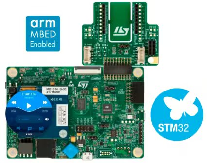
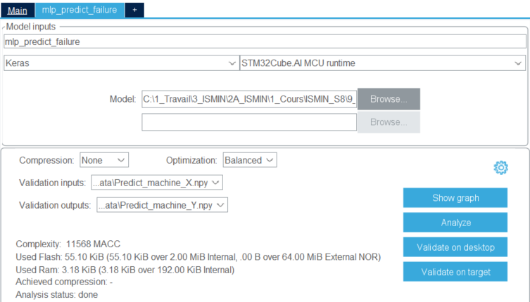

# Embedded_AI
*Abstract :* Development of a predictive AI and implementation on a STM32 Discovery Kit. 

Introduction
----------------------

**Context :** Machines of microelctronics factories are very expansive and complex. Therefore, there maintenance are considerable and has impact on the whole production line. To prevent failures, companies develop predictive maintenance. With the democratization of artifial intelligence, this domain is sky rocketing. New way of development is to use very light AI on board, to permit to the machine to predict itself its failures and avert FAB manager.

**Goal :** Train a failure predictive AI model and implement it on a STM32 Discovery Kit, to develop embedded AI for microelectronics. 

**Hardware :** Discovery kit with STM32L4R9AI MCU



**Tools :** 
- Google Collab (https://colab.research.google.com/)
- STM32 CubeIDE (https://www.st.com/en/development-tools/stm32cubeide.html)
- CubeAI (https://stm32ai.st.com/stm32-cube-ai/)

Repository structure
----------------------
- Embedded_AI 
    - **0_Data** -> *Csv, numpy files and model file for the AI training and implementation*
    - **1_CubeIDE** -> *STM32 project in C++ with CubeAI*
    - **2_Python** -> *Jupyter and python files for UART communication and AI training (in python envirronment)

Project
----------------------

#### Artificial Intelligence training

**Data :**\
The dataset contains of 10,000 machines with failure or not. For each machine, there is the operating condition of a machine and labels. Labels are the machine failure indicator and the failure type : 

*   **TWF**: Tool Wear Failure
*   **HDF**: Heat Dissipation Failure
*   **PWF**: Power Failure
*   **OSF**: Overstrain Failure
*   **RNF**: Random Failure

With a plot of this dataset, we observe that the dataset is not clean correctly. For example, some machines without failure have a RNF failure (something impossible by definition) and machine with failure can have RNF failure or no specific failure. This failure types aren't predictible, so this will descrease model accurrancy.

Moreover, our dataset has bias, because the ratio between machine_failure = 1 and machine_failure = 0 is very small 3.39%. This is bad for our model training and will creates overfitting.

To correct this problem, we have use SMOTE. It creates new datas based on current minority data. With an extensive dataset and less bias our model accurancy will be better without overfitting.

| Before SMOTE | After SMOTE |
| ------------- | ------------- |
|Shape X_train : (6981, 5) | Shape X_train : (33861, 5) |
|Shape X_test : (2992, 5) | Shape X_test : (14512, 5) |
|Shape Y_train : (6981, 5) | Shape Y_train : (33861, 5) |
|Shape Y_test : (2992, 5) | Shape Y_test : (14512, 5) |

**MLP explanation :**

Our model is composed of 3 layers of 32,64 and 128 neurons. To avoid underfitting, there is no dropout on first and second layer. \
The three first layers used ReLu to avoid the vanishing gradient effect. \
The last layer is composed of 5 neurons because we have 5 class, with Softmax to have a value in [0,1]. \
On the last layer, neurons are trained to detect specific details of data. So to avoid overfitting on dataset, we place a huge dropout on last layer. The multi-layer-perceptron is composed of **11,269 parameters**. After training and test, the accurancy is **92%**.

| Layer | Neurons | Activation Funct | Dropout |
| ------------- | ------------- | ------------- | ------ |
| 1 | 32 | ReLu | 0.0 |
| 2 | 64 | ReLu | 0.0 |
| 3 | 128 | ReLu | 0.5 |
|4 | 5 | Softmax | 0.0 |

We have exported the model to .h5 file, to implement on the board. 

### Implementation with CubeAI

CubeIDE is the default editor for STM32 board. With the CubeAI extension, we can put AI model on STM32 board. 



Thank to the previous .h5 and .npy files, we can optimize our MLP on the STM32 board, with a click on Analyze. We use Keras because our MLP model is on a .h5 file. 

---
<details><summary>Click on widget to open the analyze result</summary>

      ```Analyzing model 
      C:/Users/luc4s/STM32Cube/Repository/Packs/STMicroelectronics/X-CUBE-AI/10.0.0/Utilities/windows/stedgeai.exe analyze --target stm32l4 --name mlp_predict_failure -m C:/1_Travail/3_ISMIN/2A_ISMIN/1_Cours/ISMIN_S8/9_GP_Analytique_Industrie_Futur/1_UP_IA_Embarquee/2_Rendu/Embedded_AI/0_Data/Predict_machine.h5 --compression none --verbosity 1 --workspace C:/Users/luc4s/AppData/Local/Temp/mxAI_workspace28971001549004165106450058234944 --output C:/Users/luc4s/.stm32cubemx/mlp_predict_failure_output 
      ST Edge AI Core v2.0.0-20049 
      Creating c (debug) info json file C:\Users\luc4s\AppData\Local\Temp\mxAI_workspace28971001549004165106450058234944\mlp_predict_failure_c_info.json 
        
       Exec/report summary (analyze) 
       ------------------------------------------------------------------------------------------------------------------------------------------------------------------------ 
       model file         :   C:\1_Travail\3_ISMIN\2A_ISMIN\1_Cours\ISMIN_S8\9_GP_Analytique_Industrie_Futur\1_UP_IA_Embarquee\2_Rendu\Embedded_AI\0_Data\Predict_machine.h5    
       type               :   keras                                                                                                                                             
       c_name             :   mlp_predict_failure                                                                                                                               
       compression        :   none                                                                                                                                              
       options            :   allocate-inputs, allocate-outputs                                                                                                                 
       optimization       :   balanced                                                                                                                                          
       target/series      :   stm32l4                                                                                                                                           
       workspace dir      :   C:\Users\luc4s\AppData\Local\Temp\mxAI_workspace28971001549004165106450058234944                                                                  
       output dir         :   C:\Users\luc4s\.stm32cubemx\mlp_predict_failure_output                                                                                            
       model_fmt          :   float                                                                                                                                             
       model_name         :   Predict_machine                                                                                                                                   
       model_hash         :   0x741cba476315da776fc9d84bae9917ae                                                                                                                
       params #           :   11,269 items (44.02 KiB)                                                                                                                          
       ------------------------------------------------------------------------------------------------------------------------------------------------------------------------ 
       input 1/1          :   'input_7', f32(1x5), 20 Bytes, activations                                                                                                        
       output 1/1         :   'dense_25', f32(1x5), 20 Bytes, activations                                                                                                       
       macc               :   11,568                                                                                                                                            
       weights (ro)       :   45,076 B (44.02 KiB) (1 segment)                                                                                                                  
       activations (rw)   :   768 B (768 B) (1 segment) *                                                                                                                       
       ram (total)        :   768 B (768 B) = 768 + 0 + 0                                                                                                                       
       ------------------------------------------------------------------------------------------------------------------------------------------------------------------------ 
       (*) 'input'/'output' buffers can be used from the activations buffer 
      Computing AI RT data/code size (target=stm32l4).. 
       Model name - Predict_machine 
       ------ ------------------------ ------------- -------------- ------- ---------------- 
       m_id   layer (original)         oshape        param/size        macc     connected to 
       ------ ------------------------ ------------- -------------- ------- ---------------- 
       0      input_7 (InputLayer)     [b:1,c:5] 
       ------ ------------------------ ------------- -------------- ------- ---------------- 
       1      flatten_6 (Flatten)      [b:1,c:5]                                     input_7 
       ------ ------------------------ ------------- -------------- ------- ---------------- 
       2      dense_22_dense (Dense)   [b:1,c:32]    192/768            192        flatten_6 
              dense_22 (Dense)         [b:1,c:32]                        32   dense_22_dense 
       ------ ------------------------ ------------- -------------- ------- ---------------- 
       3      dense_23_dense (Dense)   [b:1,c:64]    2,112/8,448      2,112         dense_22 
              dense_23 (Dense)         [b:1,c:64]                        64   dense_23_dense 
       ------ ------------------------ ------------- -------------- ------- ---------------- 
       4      dense_24_dense (Dense)   [b:1,c:128]   8,320/33,280     8,320         dense_23 
              dense_24 (Dense)         [b:1,c:128]                      128   dense_24_dense 
       ------ ------------------------ ------------- -------------- ------- ---------------- 
       6      dense_25_dense (Dense)   [b:1,c:5]     645/2,580          645         dense_24 
              dense_25 (Dense)         [b:1,c:5]                         75   dense_25_dense 
       ------ ------------------------ ------------- -------------- ------- ---------------- 
       model: macc=11,568 weights=45,076 activations=-- io=-- 
       Number of operations per c-layer 
       ------- ------ ------------------------- -------- -------------- 
       c_id    m_id   name (type)                    #op           type 
       ------- ------ ------------------------- -------- -------------- 
       0       2      dense_22_dense (Dense)         192   smul_f32_f32 
       1       2      dense_22 (Nonlinearity)         32     op_f32_f32 
       2       3      dense_23_dense (Dense)       2,112   smul_f32_f32 
       3       3      dense_23 (Nonlinearity)         64     op_f32_f32 
       4       4      dense_24_dense (Dense)       8,320   smul_f32_f32 
       5       4      dense_24 (Nonlinearity)        128     op_f32_f32 
       6       6      dense_25_dense (Dense)         645   smul_f32_f32 
       7       6      dense_25 (Nonlinearity)         75     op_f32_f32 
       ------- ------ ------------------------- -------- -------------- 
       total                                      11,568 
       Number of operation types 
       ---------------- -------- ----------- 
       operation type          #           % 
       ---------------- -------- ----------- 
       smul_f32_f32       11,269       97.4% 
       op_f32_f32            299        2.6% 
       Complexity report (model) 
       ------ ---------------- ------------------------- ------------------------- -------- 
       m_id   name             c_macc                    c_rom                     c_id 
       ------ ---------------- ------------------------- ------------------------- -------- 
       2      dense_22_dense   |                  1.9%   |                  1.7%   [0, 1] 
       3      dense_23_dense   ||||              18.8%   ||||              18.7%   [2, 3] 
       4      dense_24_dense   ||||||||||||||||  73.0%   ||||||||||||||||  73.8%   [4, 5] 
       6      dense_25_dense   ||                 6.2%   ||                 5.7%   [6, 7] 
       ------ ---------------- ------------------------- ------------------------- -------- 
       macc=11,568 weights=45,076 act=768 ram_io=0 
       Requested memory size by section - "stm32l4" target 
       ------------------------------ ------- -------- ------- ----- 
       module                            text   rodata    data   bss 
       ------------------------------ ------- -------- ------- ----- 
       NetworkRuntime1000_CM4_GCC.a     7,012        0       0     0 
       mlp_predict_failure.o              608       64   2,236   160 
       mlp_predict_failure_data.o          48       16      88     0 
       lib (toolchain)*                   614       24       0     0 
       ------------------------------ ------- -------- ------- ----- 
       RT total**                       8,282      104   2,324   160 
       ------------------------------ ------- -------- ------- ----- 
       weights                              0   45,080       0     0 
       activations                          0        0       0   768 
       io                                   0        0       0     0 
       ------------------------------ ------- -------- ------- ----- 
       TOTAL                            8,282   45,184   2,324   928 
       ------------------------------ ------- -------- ------- ----- 
       *  toolchain objects (libm/libgcc*) 
       ** RT AI runtime objects (kernels+infrastructure) 
        Summary - "stm32l4" target 
        --------------------------------------------------- 
                     FLASH (ro)      %*   RAM (rw)       % 
        --------------------------------------------------- 
        RT total         10,710   19.2%      2,484   76.4% 
        --------------------------------------------------- 
        TOTAL            55,790              3,252 
        --------------------------------------------------- 
        *  rt/total 
      Creating txt report file C:\Users\luc4s\.stm32cubemx\mlp_predict_failure_output\mlp_predict_failure_analyze_report.txt 
      elapsed time (analyze): 85.680s 
      Model file:      Predict_machine.h5 
      Total Flash:     55786 B (54.48 KiB) 
          Weights:     45076 B (44.02 KiB) 
          Library:     10710 B (10.46 KiB) 
      Total Ram:       3252 B (3.18 KiB) 
          Activations: 768 B 
          Library:     2484 B (2.43 KiB) 
          Input:       20 B (included in Activations) 
          Output:      20 B (included in Activations) 
      Done 
      Analyze complete on AI model```
</details>

- - - 
After the analyze, we have *generate code*. New files appear in the **X-CUBE-AI folder**. On the *app_x-cube-ai.c*, we need to adapt **#define** to avoid transmission difficulties. \
In our case, 
- the number of **class is 5**, so put the value of CLASS_NUMBER to 5.
- we have 5 inputs on **int64 and float64**. The first idea is to put the value of BYTES_IN_FLOATS, to **5x8** (5 inputs and 8 bytes), but in the code, we transform our 64 bits inputs to 32 bits inputs. Therforen the good value is **5x4**.

```C
#define BYTES_IN_FLOATS 5*4

#define TIMEOUT 1000

#define SYNCHRONISATION 0xAB

#define ACKNOWLEDGE 0xCD

#define CLASS_NUMBER 5
```

This change made, before put the start button, we need to check our model implementation. We have a 11,269 parameters model. It takes 2.75% of flash memory and 1.65% of internal Ram. So we suppose that our STM32 board is adapted to our light model and can run it. 

> Complexity: 11568 MACC
>
>Used Flash: 55.10 KiB (55.10 KiB over 2.00 MiB Internal, .00B over 64.00 MiB External NOR) \
>Used Ram: 3.18 KiB (3.18 KiB over 192.00 KiB Internal) \
>Achieved compression: - \
>Analysis status: done \

### UART communication 

> **Project execution steps :**
> 1. Execute the CubeIDE project on the board.
> 2. Execute the main.py file with Python

UART communication is based on two files : UART_AI.py (class) and main.py.
- **UART_AI.py** is the class file. It contains functions to connect with the board, send input and read output, to evaluate the onboard model accurancy. 
    - **synchronise_UART()** : Open the communication with the board
    - **send_inputs_to_STM32(inputs)** : Send a numpy array to the board
    - **read_output_from_STM32()** : Get a list of float from the board
    - **evaluate_model_on_STM32(iterations, X_test, Y_test)** : Repeat for *iterations* iterations, the read and send loop to check the accurancy of the model. 
- **main.py** calls the class function to execute the project. It uses X_test and Y_test of the jupyter file and check on 100 iterations.

### Project output with UART communication

*Warning : The MLP model didn't work on the given card, despite the changes in CubeIDE, the result of first iteration was [ ] (None) and the python code crashed. So we have used the AREM card instead, where the same code works well.*

----
<details><summary>Click on widget to open the output</summary>

      ```txt [INFO] STM32 Connected on COM5
      Synchronising...
      Synchronised
      Evaluating model on STM32...
      ----- Iteration 1 -----
      [0.01568627450980392, 0.9803921568627451, 0.0, 0.0, 0.0]
         Expected output: [0 1 0 0 0]
         Received output: [0.01568627450980392, 0.9803921568627451, 0.0, 0.0, 0.0]
      ----------------------- Accuracy: 0.01

      ----- Iteration 2 -----
      [1.0, 0.0, 0.0, 0.0, 0.0]
         Expected output: [1 0 0 0 0]
         Received output: [1.0, 0.0, 0.0, 0.0, 0.0]
      ----------------------- Accuracy: 0.02

      ----- Iteration 3 -----
      [0.0, 0.0, 0.0, 0.0, 0.9921568627450981]
         Expected output: [0 0 0 0 1]
         Received output: [0.0, 0.0, 0.0, 0.0, 0.9921568627450981]
      ----------------------- Accuracy: 0.03

      ----- Iteration 4 -----
      [0.0, 0.0, 0.0, 0.0, 0.996078431372549]
         Expected output: [0 0 0 0 1] \
         Received output: [0.0, 0.0, 0.0, 0.0, 0.996078431372549]
      ----------------------- Accuracy: 0.04

      ----- Iteration 5 -----
      [0.0, 0.0, 0.0, 0.0, 0.996078431372549]
         Expected output: [0 0 0 0 1]
         Received output: [0.0, 0.0, 0.0, 0.0, 0.996078431372549]
      ----------------------- Accuracy: 0.05

      ----- Iteration 6 -----
      [0.3843137254901961, 0.0, 0.611764705882353, 0.0, 0.0]
         Expected output: [0 0 1 0 0]
         Received output: [0.3843137254901961, 0.0, 0. \611764705882353, 0.0, 0.0]
      ----------------------- Accuracy: 0.06

      ----- Iteration 7 -----
      [0.0, 0.0, 0.0, 0.996078431372549, 0.0]
         Expected output: [0 0 0 1 0]
         Received output: [0.0, 0.0, 0.0, 0.996078431372549, 0.0]
      ----------------------- Accuracy: 0.07

      ----- Iteration 8 -----
      [0.0392156862745098, 0.9568627450980393, 0.0, 0.0, 0.0]
         Expected output: [0 1 0 0 0]
         Received output: [0.0392156862745098, 0.9568627450980393, 0.0, 0.0, 0.0]
      ----------------------- Accuracy: 0.08

      ----- Iteration 9 -----
      [0.12549019607843137, 0.7176470588235294, 0.14901960784313725, 0.0, 0.0]
         Expected output: [0 0 1 0 0]
         Received output: [0.12549019607843137, 0.7176470588235294, 0.14901960784313725, 0.0, 0.0]
      ----------------------- Accuracy: 0.08

      ----- Iteration 10 -----
      [0.17647058823529413, 0.0, 0.8196078431372549, 0.0, 0.0]
         Expected output: [0 0 1 0 0]
         Received output: [0.17647058823529413, 0.0, 0.8196078431372549, 0.0, 0.0]
      ----------------------- Accuracy: 0.09

      ----- Iteration 11 -----
      [0.796078431372549, 0.0, 0.2, 0.0, 0.0]
         Expected output: [1 0 0 0 0]
         Received output: [0.796078431372549, 0.0, 0.2, 0.0, 0.0]
      ----------------------- Accuracy: 0.10

      ----- Iteration 12 -----
      [0.0196078431372549, 0.0, 0.0, 0.9764705882352941, 0.0]
         Expected output: [0 0 0 1 0]
         Received output: [0.0196078431372549, 0.0, 0.0, 0.9764705882352941, 0.0]
      ----------------------- Accuracy: 0.11

      ----- Iteration 13 -----
      [0.09803921568627451, 0.0, 0.8980392156862745, 0.0, 0.0]
         Expected output: [0 0 1 0 0]
         Received output: [0.09803921568627451, 0.0, 0.8980392156862745, 0.0, 0.0]
      ----------------------- Accuracy: 0.12

      ----- Iteration 14 -----
      [0.984313725490196, 0.0, 0.011764705882352941, 0.0, 0.0]
         Expected output: [1 0 0 0 0]
         Received output: [0.984313725490196, 0.0, 0.011764705882352941, 0.0, 0.0]
      ----------------------- Accuracy: 0.13

      ----- Iteration 15 -----
      [0.0, 0.0, 0.0, 0.0, 0.996078431372549]
         Expected output: [0 0 0 0 1]
         Received output: [0.0, 0.0, 0.0, 0.0, 0.996078431372549]
      ----------------------- Accuracy: 0.14

      ----- Iteration 16 -----
      [0.0, 0.0, 0.0, 0.996078431372549, 0.0]
         Expected output: [0 0 0 1 0]
         Received output: [0.0, 0.0, 0.0, 0.996078431372549, 0.0]
      ----------------------- Accuracy: 0.15

      ----- Iteration 17 -----
      [0.0, 0.0, 0.0, 0.0, 0.996078431372549]
         Expected output: [0 0 0 0 1]
         Received output: [0.0, 0.0, 0.0, 0.0, 0.996078431372549]
      ----------------------- Accuracy: 0.16

      ----- Iteration 18 -----
      [0.12941176470588237, 0.0, 0.8666666666666667, 0.0, 0.0]
         Expected output: [0 0 1 0 0]
         Received output: [0.12941176470588237, 0.0, 0.8666666666666667, 0.0, 0.0]
      ----------------------- Accuracy: 0.17

      ----- Iteration 19 -----
      [0.5568627450980392, 0.047058823529411764, 0.39215686274509803, 0.0, 0.0]
         Expected output: [1 0 0 0 0]
         Received output: [0.5568627450980392, 0.047058823529411764, 0.39215686274509803, 0.0, 0.0]
      ----------------------- Accuracy: 0.18

      ----- Iteration 20 -----
      [0.00392156862745098, 0.0, 0.00392156862745098, 0.0, 0.9882352941176471]
         Expected output: [0 0 0 0 1]
         Received output: [0.00392156862745098, 0.0, 0.00392156862745098, 0.0, 0.9882352941176471]
      ----------------------- Accuracy: 0.19

      ----- Iteration 21 -----
      [0.023529411764705882, 0.9725490196078431, 0.0, 0.0, 0.0]
         Expected output: [0 1 0 0 0]
         Received output: [0.023529411764705882, 0.9725490196078431, 0.0, 0.0, 0.0]
      ----------------------- Accuracy: 0.20

      ----- Iteration 22 -----
      [0.0, 0.0, 0.0, 0.996078431372549, 0.0]
         Expected output: [0 0 0 1 0]
         Received output: [0.0, 0.0, 0.0, 0.996078431372549, 0.0]
      ----------------------- Accuracy: 0.21

      ----- Iteration 23 -----
      [0.0, 0.0, 0.0, 0.996078431372549, 0.0]
         Expected output: [0 0 0 1 0]
         Received output: [0.0, 0.0, 0.0, 0.996078431372549, 0.0]
      ----------------------- Accuracy: 0.22

      ----- Iteration 24 -----
      [0.10196078431372549, 0.0, 0.8941176470588236, 0.0, 0.0]
         Expected output: [0 0 1 0 0]
         Received output: [0.10196078431372549, 0.0, 0.8941176470588236, 0.0, 0.0]
      ----------------------- Accuracy: 0.23

      ----- Iteration 25 -----
      [0.0392156862745098, 0.9568627450980393, 0.0, 0.0, 0.0]
         Expected output: [0 1 0 0 0]
         Received output: [0.0392156862745098, 0.9568627450980393, 0.0, 0.0, 0.0]
      ----------------------- Accuracy: 0.24

      ----- Iteration 26 -----
      [0.15294117647058825, 0.0, 0.8392156862745098, 0.00392156862745098, 0.0]
         Expected output: [0 0 1 0 0]
         Received output: [0.15294117647058825, 0.0, 0.8392156862745098, 0.00392156862745098, 0.0]
      ----------------------- Accuracy: 0.25

      ----- Iteration 27 -----
      [1.0, 0.0, 0.0, 0.0, 0.0]
         Expected output: [1 0 0 0 0]
         Received output: [1.0, 0.0, 0.0, 0.0, 0.0]
      ----------------------- Accuracy: 0.26

      ----- Iteration 28 -----
      [0.0, 0.0, 0.0, 0.0, 0.996078431372549]
         Expected output: [0 0 0 0 1]
         Received output: [0.0, 0.0, 0.0, 0.0, 0.996078431372549]
      ----------------------- Accuracy: 0.27

      ----- Iteration 29 -----
      [1.0, 0.0, 0.0, 0.0, 0.0]
         Expected output: [1 0 0 0 0]
         Received output: [1.0, 0.0, 0.0, 0.0, 0.0]
      ----------------------- Accuracy: 0.28

      ----- Iteration 30 -----
      [0.03137254901960784, 0.9647058823529412, 0.0, 0.0, 0.0]
         Expected output: [0 1 0 0 0]
         Received output: [0.03137254901960784, 0.9647058823529412, 0.0, 0.0, 0.0]
      ----------------------- Accuracy: 0.29

      ----- Iteration 31 -----
      [0.0, 0.0, 0.0, 0.996078431372549, 0.0]
         Expected output: [0 0 0 1 0]
         Received output: [0.0, 0.0, 0.0, 0.996078431372549, 0.0]
      ----------------------- Accuracy: 0.30

      ----- Iteration 32 -----
      [1.0, 0.0, 0.0, 0.0, 0.0]
         Expected output: [1 0 0 0 0]
         Received output: [1.0, 0.0, 0.0, 0.0, 0.0]
      ----------------------- Accuracy: 0.31

      ----- Iteration 33 -----
      [0.0, 0.0, 0.0, 0.0, 0.996078431372549]
         Expected output: [0 0 0 0 1]
         Received output: [0.0, 0.0, 0.0, 0.0, 0.996078431372549]
      ----------------------- Accuracy: 0.32

      ----- Iteration 34 -----
      [0.1450980392156863, 0.0, 0.8509803921568627, 0.0, 0.0]
         Expected output: [0 0 1 0 0]
         Received output: [0.1450980392156863, 0.0, 0.8509803921568627, 0.0, 0.0]
      ----------------------- Accuracy: 0.33

      ----- Iteration 35 -----
      [0.011764705882352941, 0.0, 0.0, 0.984313725490196, 0.0]
         Expected output: [0 0 0 1 0]
         Received output: [0.011764705882352941, 0.0, 0.0, 0.984313725490196, 0.0]
      ----------------------- Accuracy: 0.34

      ----- Iteration 36 -----
      [0.0, 0.0, 0.0, 0.0, 0.996078431372549]
         Expected output: [0 0 0 0 1]
         Received output: [0.0, 0.0, 0.0, 0.0, 0.996078431372549]
      ----------------------- Accuracy: 0.35

      ----- Iteration 37 -----
      [0.01568627450980392, 0.0, 0.0, 0.9803921568627451, 0.0]
         Expected output: [0 0 0 1 0]
         Received output: [0.01568627450980392, 0.0, 0.0, 0.9803921568627451, 0.0]
      ----------------------- Accuracy: 0.36

      ----- Iteration 38 -----
      [0.996078431372549, 0.0, 0.0, 0.0, 0.0]
         Expected output: [1 0 0 0 0]
         Received output: [0.996078431372549, 0.0, 0.0, 0.0, 0.0]
      ----------------------- Accuracy: 0.37

      ----- Iteration 39 -----
      [0.6274509803921569, 0.3686274509803922, 0.0, 0.0, 0.0]
         Expected output: [1 0 0 0 0]
         Received output: [0.6274509803921569, 0.3686274509803922, 0.0, 0.0, 0.0]
      ----------------------- Accuracy: 0.38

      ----- Iteration 40 -----
      [0.13333333333333333, 0.0, 0.8627450980392157, 0.0, 0.0]
         Expected output: [1 0 0 0 0]
         Received output: [0.13333333333333333, 0.0, 0.8627450980392157, 0.0, 0.0]
      ----------------------- Accuracy: 0.38

      ----- Iteration 41 -----
      [1.0, 0.0, 0.0, 0.0, 0.0]
         Expected output: [1 0 0 0 0]
         Received output: [1.0, 0.0, 0.0, 0.0, 0.0]
      ----------------------- Accuracy: 0.39

      ----- Iteration 42 -----
      [0.0, 0.0, 0.0, 0.996078431372549, 0.0]
         Expected output: [0 0 0 1 0]
         Received output: [0.0, 0.0, 0.0, 0.996078431372549, 0.0]
      ----------------------- Accuracy: 0.40

      ----- Iteration 43 -----
      [0.011764705882352941, 0.0, 0.0, 0.984313725490196, 0.0]
         Expected output: [0 0 0 1 0]
         Received output: [0.011764705882352941, 0.0, 0.0, 0.984313725490196, 0.0]
      ----------------------- Accuracy: 0.41

      ----- Iteration 44 -----
      [0.0, 0.0, 0.0, 0.0, 0.996078431372549]
         Expected output: [0 0 0 0 1]
         Received output: [0.0, 0.0, 0.0, 0.0, 0.996078431372549]
      ----------------------- Accuracy: 0.42

      ----- Iteration 45 -----
      [0.1568627450980392, 0.0, 0.8392156862745098, 0.0, 0.0]
         Expected output: [0 0 1 0 0]
         Received output: [0.1568627450980392, 0.0, 0.8392156862745098, 0.0, 0.0]
      ----------------------- Accuracy: 0.43

      ----- Iteration 46 -----
      [0.043137254901960784, 0.9529411764705882, 0.0, 0.0, 0.0]
         Expected output: [0 1 0 0 0]
         Received output: [0.043137254901960784, 0.9529411764705882, 0.0, 0.0, 0.0]
      ----------------------- Accuracy: 0.44

      ----- Iteration 47 -----
      [0.03529411764705882, 0.9607843137254902, 0.0, 0.0, 0.0]
         Expected output: [0 1 0 0 0]
         Received output: [0.03529411764705882, 0.9607843137254902, 0.0, 0.0, 0.0]
      ----------------------- Accuracy: 0.45

      ----- Iteration 48 -----
      [1.0, 0.0, 0.0, 0.0, 0.0]
         Expected output: [1 0 0 0 0]
         Received output: [1.0, 0.0, 0.0, 0.0, 0.0]
      ----------------------- Accuracy: 0.46

      ----- Iteration 49 -----
      [0.0392156862745098, 0.9568627450980393, 0.0, 0.0, 0.0]
         Expected output: [0 1 0 0 0]
         Received output: [0.0392156862745098, 0.9568627450980393, 0.0, 0.0, 0.0]
      ----------------------- Accuracy: 0.47

      ----- Iteration 50 -----
      [0.0, 0.0, 0.0, 0.0, 0.996078431372549]
         Expected output: [0 0 0 0 1]
         Received output: [0.0, 0.0, 0.0, 0.0, 0.996078431372549]
      ----------------------- Accuracy: 0.48

      ----- Iteration 51 -----
      [0.10588235294117647, 0.0, 0.8901960784313725, 0.0, 0.0]
         Expected output: [0 0 1 0 0]
         Received output: [0.10588235294117647, 0.0, 0.8901960784313725, 0.0, 0.0]
      ----------------------- Accuracy: 0.49

      ----- Iteration 52 -----
      [0.01568627450980392, 0.9686274509803922, 0.0, 0.0, 0.011764705882352941]
         Expected output: [0 1 0 0 0]
         Received output: [0.01568627450980392, 0.9686274509803922, 0.0, 0.0, 0.011764705882352941]
      ----------------------- Accuracy: 0.50

      ----- Iteration 53 -----
      [0.0, 0.03529411764705882, 0.0, 0.0, 0.9568627450980393]
         Expected output: [0 0 0 0 1]
         Received output: [0.0, 0.03529411764705882, 0.0, 0.0, 0.9568627450980393]
      ----------------------- Accuracy: 0.51

      ----- Iteration 54 -----
      [0.12941176470588237, 0.0, 0.8627450980392157, 0.0, 0.0]
         Expected output: [0 0 1 0 0]
         Received output: [0.12941176470588237, 0.0, 0.8627450980392157, 0.0, 0.0]
      ----------------------- Accuracy: 0.52

      ----- Iteration 55 -----
      [0.03137254901960784, 0.9647058823529412, 0.0, 0.0, 0.0]
         Expected output: [0 1 0 0 0]
         Received output: [0.03137254901960784, 0.9647058823529412, 0.0, 0.0, 0.0]
      ----------------------- Accuracy: 0.53

      ----- Iteration 56 -----
      [0.00392156862745098, 0.0, 0.00392156862745098, 0.0, 0.9882352941176471]
         Expected output: [0 0 0 0 1]
         Received output: [0.00392156862745098, 0.0, 0.00392156862745098, 0.0, 0.9882352941176471]
      ----------------------- Accuracy: 0.54

      ----- Iteration 57 -----
      [0.9411764705882353, 0.0, 0.0, 0.050980392156862744, 0.0]
         Expected output: [1 0 0 0 0]
         Received output: [0.9411764705882353, 0.0, 0.0, 0.050980392156862744, 0.0]
      ----------------------- Accuracy: 0.55

      ----- Iteration 58 -----
      [0.9294117647058824, 0.0, 0.06666666666666667, 0.0, 0.0]
         Expected output: [1 0 0 0 0]
         Received output: [0.9294117647058824, 0.0, 0.06666666666666667, 0.0, 0.0]
      ----------------------- Accuracy: 0.56

      ----- Iteration 59 -----
      [0.043137254901960784, 0.9490196078431372, 0.0, 0.0, 0.0]
         Expected output: [0 1 0 0 0]
         Received output: [0.043137254901960784, 0.9490196078431372, 0.0, 0.0, 0.0]
      ----------------------- Accuracy: 0.57

      ----- Iteration 60 -----
      [0.0196078431372549, 0.9764705882352941, 0.0, 0.0, 0.0]
         Expected output: [0 1 0 0 0]
         Received output: [0.0196078431372549, 0.9764705882352941, 0.0, 0.0, 0.0]
      ----------------------- Accuracy: 0.58

      ----- Iteration 61 -----
      [0.011764705882352941, 0.01568627450980392, 0.0, 0.0, 0.9647058823529412]
         Expected output: [0 0 0 0 1]
         Received output: [0.011764705882352941, 0.01568627450980392, 0.0, 0.0, 0.9647058823529412]
      ----------------------- Accuracy: 0.59

      ----- Iteration 62 -----
      [0.1450980392156863, 0.0, 0.8509803921568627, 0.0, 0.0]
         Expected output: [0 0 1 0 0]
         Received output: [0.1450980392156863, 0.0, 0.8509803921568627, 0.0, 0.0]
      ----------------------- Accuracy: 0.60

      ----- Iteration 63 -----
      [0.0, 0.0, 0.0, 0.996078431372549, 0.0]
         Expected output: [0 0 0 1 0]
         Received output: [0.0, 0.0, 0.0, 0.996078431372549, 0.0]
      ----------------------- Accuracy: 0.61

      ----- Iteration 64 -----
      [0.09019607843137255, 0.0, 0.9058823529411765, 0.0, 0.0]
         Expected output: [0 0 1 0 0]
         Received output: [0.09019607843137255, 0.0, 0.9058823529411765, 0.0, 0.0]
      ----------------------- Accuracy: 0.62

      ----- Iteration 65 -----
      [0.10588235294117647, 0.0, 0.8901960784313725, 0.0, 0.0]
         Expected output: [0 0 1 0 0]
         Received output: [0.10588235294117647, 0.0, 0.8901960784313725, 0.0, 0.0]
      ----------------------- Accuracy: 0.63

      ----- Iteration 66 -----
      [0.07450980392156863, 0.9215686274509803, 0.0, 0.0, 0.0]
         Expected output: [1 0 0 0 0]
         Received output: [0.07450980392156863, 0.9215686274509803, 0.0, 0.0, 0.0]
      ----------------------- Accuracy: 0.63

      ----- Iteration 67 -----
      [0.03529411764705882, 0.9607843137254902, 0.0, 0.0, 0.0]
         Expected output: [0 1 0 0 0]
         Received output: [0.03529411764705882, 0.9607843137254902, 0.0, 0.0, 0.0]
      ----------------------- Accuracy: 0.64

      ----- Iteration 68 -----
      [0.03137254901960784, 0.9647058823529412, 0.0, 0.0, 0.0]
         Expected output: [0 1 0 0 0]
         Received output: [0.03137254901960784, 0.9647058823529412, 0.0, 0.0, 0.0]
      ----------------------- Accuracy: 0.65

      ----- Iteration 69 -----
      [0.027450980392156862, 0.9686274509803922, 0.0, 0.0, 0.0]
         Expected output: [0 1 0 0 0]
         Received output: [0.027450980392156862, 0.9686274509803922, 0.0, 0.0, 0.0]
      ----------------------- Accuracy: 0.66

      ----- Iteration 70 -----
      [0.0392156862745098, 0.9568627450980393, 0.0, 0.0, 0.0]
         Expected output: [0 1 0 0 0]
         Received output: [0.0392156862745098, 0.9568627450980393, 0.0, 0.0, 0.0]
      ----------------------- Accuracy: 0.67

      ----- Iteration 71 -----
      [1.0, 0.0, 0.0, 0.0, 0.0]
         Expected output: [1 0 0 0 0]
         Received output: [1.0, 0.0, 0.0, 0.0, 0.0]
      ----------------------- Accuracy: 0.68

      ----- Iteration 72 -----
      [0.043137254901960784, 0.0, 0.0, 0.9529411764705882, 0.0]
         Expected output: [0 0 0 1 0]
         Received output: [0.043137254901960784, 0.0, 0.0, 0.9529411764705882, 0.0]
      ----------------------- Accuracy: 0.69

      ----- Iteration 73 -----
      [0.0, 0.0, 0.0, 0.996078431372549, 0.0]
         Expected output: [0 0 0 1 0]
         Received output: [0.0, 0.0, 0.0, 0.996078431372549, 0.0]
      ----------------------- Accuracy: 0.70

      ----- Iteration 74 -----
      [1.0, 0.0, 0.0, 0.0, 0.0]
         Expected output: [1 0 0 0 0]
         Received output: [1.0, 0.0, 0.0, 0.0, 0.0]
      ----------------------- Accuracy: 0.71

      ----- Iteration 75 -----
      [0.996078431372549, 0.0, 0.0, 0.0, 0.0]
         Expected output: [1 0 0 0 0]
         Received output: [0.996078431372549, 0.0, 0.0, 0.0, 0.0]
      ----------------------- Accuracy: 0.72

      ----- Iteration 76 -----
      [0.00784313725490196, 0.9803921568627451, 0.0, 0.0, 0.00392156862745098]
         Expected output: [0 1 0 0 0]
         Received output: [0.00784313725490196, 0.9803921568627451, 0.0, 0.0, 0.00392156862745098]
      ----------------------- Accuracy: 0.73

      ----- Iteration 77 -----
      [0.023529411764705882, 0.0, 0.0, 0.9725490196078431, 0.0]
         Expected output: [0 0 0 1 0]
         Received output: [0.023529411764705882, 0.0, 0.0, 0.9725490196078431, 0.0]
      ----------------------- Accuracy: 0.74

      ----- Iteration 78 -----
      [0.15294117647058825, 0.0, 0.8431372549019608, 0.0, 0.0]
         Expected output: [1 0 0 0 0]
         Received output: [0.15294117647058825, 0.0, 0.8431372549019608, 0.0, 0.0]
      ----------------------- Accuracy: 0.74

      ----- Iteration 79 -----
      [0.027450980392156862, 0.9686274509803922, 0.0, 0.0, 0.0]
         Expected output: [0 1 0 0 0]
         Received output: [0.027450980392156862, 0.9686274509803922, 0.0, 0.0, 0.0]
      ----------------------- Accuracy: 0.75

      ----- Iteration 80 -----
      [1.0, 0.0, 0.0, 0.0, 0.0]
         Expected output: [1 0 0 0 0]
         Received output: [1.0, 0.0, 0.0, 0.0, 0.0]
      ----------------------- Accuracy: 0.76

      ----- Iteration 81 -----
      [0.12941176470588237, 0.0, 0.8666666666666667, 0.0, 0.0]
         Expected output: [0 0 1 0 0]
         Received output: [0.12941176470588237, 0.0, 0.8666666666666667, 0.0, 0.0]
      ----------------------- Accuracy: 0.77

      ----- Iteration 82 -----
      [0.0, 0.0, 0.0, 0.996078431372549, 0.0]
         Expected output: [0 0 0 1 0]
         Received output: [0.0, 0.0, 0.0, 0.996078431372549, 0.0]
      ----------------------- Accuracy: 0.78

      ----- Iteration 83 -----
      [1.0, 0.0, 0.0, 0.0, 0.0]
         Expected output: [1 0 0 0 0]
         Received output: [1.0, 0.0, 0.0, 0.0, 0.0]
      ----------------------- Accuracy: 0.79

      ----- Iteration 84 -----
      [0.4666666666666667, 0.0, 0.5294117647058824, 0.0, 0.0]
         Expected output: [0 0 1 0 0]
         Received output: [0.4666666666666667, 0.0, 0.5294117647058824, 0.0, 0.0]
      ----------------------- Accuracy: 0.80

      ----- Iteration 85 -----
      [1.0, 0.0, 0.0, 0.0, 0.0]
         Expected output: [1 0 0 0 0]
         Received output: [1.0, 0.0, 0.0, 0.0, 0.0]
      ----------------------- Accuracy: 0.81

      ----- Iteration 86 -----
      [0.20784313725490197, 0.0, 0.788235294117647, 0.0, 0.0]
         Expected output: [0 0 1 0 0]
         Received output: [0.20784313725490197, 0.0, 0.788235294117647, 0.0, 0.0]
      ----------------------- Accuracy: 0.82

      ----- Iteration 87 -----
      [0.19215686274509805, 0.0, 0.803921568627451, 0.0, 0.0]
         Expected output: [0 0 1 0 0]
         Received output: [0.19215686274509805, 0.0, 0.803921568627451, 0.0, 0.0]
      ----------------------- Accuracy: 0.83

      ----- Iteration 88 -----
      [0.0, 0.0, 0.0, 0.0, 0.996078431372549]
         Expected output: [0 0 0 0 1]
         Received output: [0.0, 0.0, 0.0, 0.0, 0.996078431372549]
      ----------------------- Accuracy: 0.84

      ----- Iteration 89 -----
      [0.0, 0.0, 0.0, 0.0, 0.996078431372549]
         Expected output: [0 0 0 0 1]
         Received output: [0.0, 0.0, 0.0, 0.0, 0.996078431372549]
      ----------------------- Accuracy: 0.85

      ----- Iteration 90 -----
      [0.00392156862745098, 0.0, 0.00392156862745098, 0.0, 0.9882352941176471]
         Expected output: [0 0 0 0 1]
         Received output: [0.00392156862745098, 0.0, 0.00392156862745098, 0.0, 0.9882352941176471]
      ----------------------- Accuracy: 0.86

      ----- Iteration 91 -----
      [1.0, 0.0, 0.0, 0.0, 0.0]
         Expected output: [1 0 0 0 0]
         Received output: [1.0, 0.0, 0.0, 0.0, 0.0]
      ----------------------- Accuracy: 0.87

      ----- Iteration 92 -----
      [0.00392156862745098, 0.0, 0.0, 0.9921568627450981, 0.0]
         Expected output: [0 0 0 1 0]
         Received output: [0.00392156862745098, 0.0, 0.0, 0.9921568627450981, 0.0]
      ----------------------- Accuracy: 0.88

      ----- Iteration 93 -----
      [0.011764705882352941, 0.054901960784313725, 0.0, 0.0, 0.9254901960784314]
         Expected output: [0 0 0 0 1]
         Received output: [0.011764705882352941, 0.054901960784313725, 0.0, 0.0, 0.9254901960784314]
      ----------------------- Accuracy: 0.89

      ----- Iteration 94 -----
      [0.10196078431372549, 0.0, 0.8941176470588236, 0.0, 0.0]
         Expected output: [0 0 1 0 0]
         Received output: [0.10196078431372549, 0.0, 0.8941176470588236, 0.0, 0.0]
      ----------------------- Accuracy: 0.90

      ----- Iteration 95 -----
      [0.00392156862745098, 0.0, 0.01568627450980392, 0.9725490196078431, 0.0]
         Expected output: [0 0 0 1 0]
         Received output: [0.00392156862745098, 0.0, 0.01568627450980392, 0.9725490196078431, 0.0]
      ----------------------- Accuracy: 0.91

      ----- Iteration 96 -----
      [0.06274509803921569, 0.0, 0.0, 0.9333333333333333, 0.0]
         Expected output: [0 0 0 1 0]
         Received output: [0.06274509803921569, 0.0, 0.0, 0.9333333333333333, 0.0]
      ----------------------- Accuracy: 0.92

      ----- Iteration 97 -----
      [0.00392156862745098, 0.0, 0.00392156862745098, 0.0, 0.984313725490196]
         Expected output: [0 0 0 0 1]
         Received output: [0.00392156862745098, 0.0, 0.00392156862745098, 0.0, 0.984313725490196]
      ----------------------- Accuracy: 0.93

      ----- Iteration 98 -----
      [0.0, 0.0, 0.00392156862745098, 0.9882352941176471, 0.0]
         Expected output: [0 0 0 1 0]
         Received output: [0.0, 0.0, 0.00392156862745098, 0.9882352941176471, 0.0]
      ----------------------- Accuracy: 0.94

      ----- Iteration 99 -----
      [0.14901960784313725, 0.0, 0.8470588235294118, 0.0, 0.0]
         Expected output: [0 0 1 0 0]
         Received output: [0.14901960784313725, 0.0, 0.8470588235294118, 0.0, 0.0]
      ----------------------- Accuracy: 0.95

      ----- Iteration 100 -----
      [0.0, 0.0, 0.0, 0.0, 0.996078431372549]
         Expected output: [0 0 0 0 1]
         Received output: [0.0, 0.0, 0.0, 0.0, 0.996078431372549]
      ----------------------- Accuracy: 0.96```
</details>

----
Previously, we have generate to numpy files with input and output of the dataset : 
- *Predict_machine_X.npy*
- *Predict_machine_Y.npy*

With the class UART_AI, we can test our onboard MLP model on N iterations of the Predict_machine dataset. For each iteration where the argmax of Predict_machine_Y.npy (index of the class with the greater value) is equal to the calculate argmax of the model, the accurancy += 1/(number of iterations). \
In the upper case, we test the model on **100** iterations. Each good answer, add 0.01 to the accurancy. Our practical accurancy is 96% on this dataset with this board. This value is near to our theoretical accurancy of 92%. 